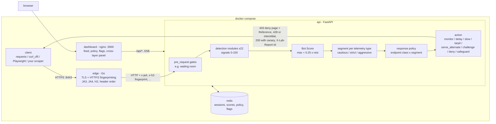

[](https://github.com/cesarhmatias/akamai-style-bot-lab/actions/workflows/ci.yml)
[](pyproject.toml)
[](edge/)
[](pyproject.toml)
[](docker-compose.yml)
[](clients/playwright_client.py)
[](LICENSE)

# Akamai-style bot detection lab

A self-hosted, local-only playground that **simulates** the observable behaviour of Akamai Bot Manager: passive
fingerprints (TLS/JA4, HTTP/2, header order, cross-layer version checks), cookies and sensor telemetry, challenges
(proof of work, pixel, SBSD-style, interactive tiles), behavioral signals, rate controls, and a **Bot Score with response
actions** (monitor, delay, slow, tarpit, serve alternate content, challenge, deny). You point your own scrapers and
automation at your own server and see exactly why each one is scored the way it is.

> **SCOPE.** This is an educational simulation of observable Akamai behaviour, calibrated from public sources (see the
> [2026-10 audit](docs/research/akamai-audit-2026-10.md)), **not a replica of the product**. It is not affiliated with
> Akamai. Anything the audit could not verify is either off by default behind a flag or labelled an approximation; the full
> list is in [docs/KNOWN_GAPS.md](docs/KNOWN_GAPS.md).

> **DISCLAIMER.** This project SIMULATES Akamai-style detection for education and testing your own clients.
> It is not affiliated with, endorsed by, or derived from Akamai Technologies and contains no proprietary
> Akamai code. "Akamai" is a trademark of its owner. Use it only against the servers you run yourself.

## Architecture



More detail (request lifecycle, scoring, state keys): [docs/architecture.md](docs/architecture.md). Bot Score, segments and
actions: [docs/cases/bot_score.md](docs/cases/bot_score.md).

### Why an edge proxy?
TLS and HTTP/2 terminate before the ASGI app. FastAPI/uvicorn only ever sees a decoded request: it cannot see the
TLS ClientHello (cipher and extension order, GREASE), the HTTP/2 SETTINGS and WINDOW_UPDATE frames, the HPACK header
order, or the original header casing (Python servers normalise it). Real bot managers sit at the CDN edge for this reason,
so the lab has a small Go reverse proxy (`edge/`) that terminates TLS, computes the fingerprints and hands them to the api
as injected `x-*` headers (client-supplied copies are stripped). See [edge/README.md](edge/README.md).

## The cases

Every module has a doc under [docs/cases/](docs/cases/) with what it is, how real Akamai uses it (cited), its confidence
tier, the exact checks, how a scraper passes it and the observed results. Tiers are defined in the
[confidence section](#confidence-tiers--feature-flags) below. "Default" is whether the module is enabled on a fresh lab.

| case | category | tier | default | what it checks |
|---|---|---|---|---|
| [tls_fingerprint](docs/cases/tls_fingerprint.md) | passive | HIGH | on | JA3/JA4 hello family vs the UA, Chrome era markers, extension order |
| [h2_fingerprint](docs/cases/h2_fingerprint.md) | passive | HIGH | on | HTTP/2 SETTINGS, WINDOW_UPDATE, pseudo-header order (Akamai 2017 format) |
| [header_order](docs/cases/header_order.md) | passive | HIGH | on | header set, order, casing and Chrome-version values |
| [version_consistency](docs/cases/version_consistency.md) | passive | HIGH | on | UA vs TLS vs headers vs `sec-ch-ua` vs JS Chrome major |
| [known_bots](docs/cases/known_bots.md) | passive | MEDIUM | on | crawler impersonators, Web Bot Auth signatures, AI bot categories |
| [ip_reputation](docs/cases/ip_reputation.md) | network | HIGH | on | burst/average rate controls, penalty box, reputation categories |
| [botnet_cluster](docs/cases/botnet_cluster.md) | network | LOW | **off** | fingerprint clusters across IPs (flag `botnet_cluster`) |
| [tcp_fingerprint](docs/cases/tcp_fingerprint.md) | passive | LOW | **off** | deferred stub: needs raw SYN capture |
| [abck_cookie](docs/cases/abck_cookie.md) | cookie | MEDIUM | on | `_abck` validated server-side and bound to the client |
| [sensor_data](docs/cases/sensor_data.md) | js | MEDIUM | on | obfuscated sensor POSTed to a per-session random path |
| [js_integrity](docs/cases/js_integrity.md) | js | HIGH | on | native getters, `webdriver`, headless markers, automation globals |
| [session_validation](docs/cases/session_validation.md) | behavioral | MEDIUM | on | page navigations vs XHR chain per session |
| [behavioral](docs/cases/behavioral.md) | behavioral | HIGH | on | mouse, keyboard, touch and motion telemetry |
| [proof_of_work](docs/cases/proof_of_work.md) | js | MEDIUM | on | `sec_cpt` providers, minimum solve time, 428 vs iframe, cookieless `bm-verify` interstitial |
| [pixel_challenge](docs/cases/pixel_challenge.md) | js | MEDIUM | on | value in the HTML posted to `/akam/<n>/pixel_<hex>` |
| [sbsd_challenge](docs/cases/sbsd_challenge.md) | js | LOW | on (lab device) | per-issuance JS op chain; vendor flow behind `sbsd_vendor_flow` |
| [interactive_challenge](docs/cases/interactive_challenge.md) | behavioral | MEDIUM | on | tile mini-game, AJAX challenge injection |
| [avf_stepup](docs/cases/avf_stepup.md) | js | MEDIUM | on | on-demand extra data (WebGL, audio, fonts) for gray-zone sessions |
| [inline_telemetry](docs/cases/inline_telemetry.md) | js | HIGH | on | request-bound `akamai-bm-telemetry` on login/checkout |
| [account_protector](docs/cases/account_protector.md) | behavioral | MEDIUM | on | per-account login risk, `Akamai-User-Risk` origin header |
| [native_app](docs/cases/native_app.md) | js | MEDIUM | on | `X-acf-sensor-data` on `/mobile/api/*` |
| [visitor_prioritization](docs/cases/visitor_prioritization.md) | network | LOW | **off** | waiting-room gate (flag `akavpau_cookie_name`) |
| [bot_score](docs/cases/bot_score.md) | engine | HIGH | always | aggregation, bands, per-endpoint policy, actions, deny page |

## Results

Generated by `python -m clients.run_matrix`. Every cell is judged from the case's own signal in the score report
(`X-Lab-Report-Id` then `GET /api/requests/{id}`), not from the HTTP status (✅ = verdict pass or skip, ⚠️ = warn,
❌ = fail or block). CI runs the matrix on every push and fails if it drifts from `clients/expected_matrix.json`;
per-signal reasons, how a failing client would pass, and the before/after note for the audit remediation are in
[RESULTS.md](RESULTS.md).

| case | endpoint | naive | curl_cffi | playwright |
|---|---|---|---|---|
| tls_fingerprint | protected | ❌ | ✅ | ⚠️ |
| h2_fingerprint | protected | ❌ | ✅ | ✅ |
| header_order | protected | ❌ | ✅ | ❌ |
| version_consistency | protected | ✅ | ✅ | ❌ |
| known_bots | protected | ✅ | ✅ | ✅ |
| ip_reputation | protected | ✅ | ✅ | ✅ |
| session_validation | protected | ❌ | ✅ | ✅ |
| abck_cookie | protected | ❌ | ❌ | ✅ |
| sensor_data | protected | ❌ | ❌ | ✅ |
| js_integrity | protected | ❌ | ❌ | ❌ |
| behavioral | protected | ❌ | ❌ | ✅ |
| proof_of_work | protected | ❌ | ✅ | ✅ |
| pixel_challenge | protected | ❌ | ✅ | ✅ |
| sbsd_challenge | protected | ❌ | ❌ | ✅ |
| interactive_challenge | protected | ❌ | ❌ | ✅ |
| avf_stepup | protected | ⚠️ | ⚠️ | ✅ |
| inline_telemetry | checkout | ❌ | ❌ | ✅ |
| account_protector | login | ✅ | ✅ | ✅ |
| native_app | mobile | ❌ | ✅ | ❌ |
| pow_interstitial | interstitial | ❌ | ⚠️ | ⚠️ |
| pow_interstitial_hardened | interstitial | ❌ | ❌ | ⚠️ |

- **naive**: plain `requests`, no scripts. **curl_cffi**: Chrome 131 impersonation (pinned, about 23 majors old),
  solves proof of work and pixel in pure Python, runs no JS. **playwright**: headless Chromium with a UA override
  to Chrome/131, a masked `navigator.webdriver` and a seeded Bezier mouse path; the new version and integrity checks
  catch both overrides.
- **pow_interstitial** rows: the cookieless `bm-verify` arithmetic interstitial (flag `pow_cookieless_gate`, plus the LAB flag
  `pow_interstitial_hardened` for the second row). A regex-only curl_cffi solves the basic page (⚠️: solving it is weak evidence,
  WARN 20, served under monitoring) and is stopped by the randomized hardened shape (❌); Playwright runs the page's own script
  (⚠️). See
  [proof_of_work](docs/cases/proof_of_work.md#cookieless-bm-verify-interstitial).
- The Playwright and curl_cffi versions are pinned in `pyproject.toml` because the Playwright JA4 depends on the bundled
  Chromium build.

### Observed fingerprints (real run)

| client | proto | JA4 | H2 fingerprint | header order (wire) |
|---|---|---|---|---|
| naive (`requests` 2.34.2) | http/1.1 | `t13d3112h1_e8f1e7e78f70_b26ce05bbdd6` | (none) | `Host,User-Agent,Accept-Encoding,Accept,Connection,X-Lab-Client,Cookie` |
| curl_cffi `chrome131` | h2 | `t13d1516h2_8daaf6152771_02713d6af862` | `1:65536;2:0;4:6291456;6:262144\|15663105\|0\|m,a,s,p` | `sec-ch-ua,sec-ch-ua-mobile,sec-ch-ua-platform,upgrade-insecure-requests,user-agent,accept,sec-fetch-site,...,accept-encoding,accept-language,priority,x-lab-client` |
| Playwright Chromium | h2 | `t13d1516h2_8daaf6152771_806a8c22fdea` | `1:65536;2:0;4:6291456;6:262144\|15663105\|0\|m,a,s,p` | `sec-ch-ua,...,user-agent,x-lab-client,accept-language,accept,sec-fetch-*,accept-encoding,priority` |

(`curl` itself gives `t13d3112h2_e8f1e7e78f70_b26ce05bbdd6`: same cipher/extension hashes as `requests`, but it offers `h2`.)

## Confidence tiers & feature flags

Every behaviour carries one of four tiers (audit §3.1, `Confidence` in `api/app/contract.py`). They govern how it ships:

| Tier | Meaning | How it ships |
|---|---|---|
| `high` | well backed by Akamai's own documentation or Chromium docs | real lab behaviour, on by default, stated as fact |
| `medium` | implemented from independent secondary sources | on by default; docs label it an **approximation** and cite the tier |
| `low` | vendor-sourced or unverified | behind a feature flag, **off by default**, docs say "unverified, vendor-sourced" |
| `lab` | lab-only teaching device with no known Akamai analogue | said so explicitly |

Flags resolve as: store key `flag:{name}` (set from the dashboard, `PUT /api/flags/{name}` with `{"value": true}`), then the
environment variable `LAB_FLAG_<NAME>`, then the default. `GET /api/flags` lists all of them with their current value.

| Flag | Default | Tier | Declared by | Effect |
|---|---|---|---|---|
| `ajax_challenge_injection` | **on** | high | `interactive_challenge` | inject the helper that challenges `fetch` / XHR calls |
| `rate_id_ip_useragent` | off | high | `ip_reputation` | rate-control identifier = IP + User-Agent |
| `rate_id_tls_fingerprint` | off | high | `ip_reputation` | rate-control identifier = JA4 |
| `akamai_ghost_server_header` | **on** | medium | engine | send `Server: AkamaiGHost` on deny pages |
| `pow_cookieless_gate` | off | medium | `proof_of_work` | serve the `bm-verify` interstitial to HTML navigations until the session has server-side proof |
| `pow_interstitial_location` | off | low | `proof_of_work` | add a same-origin JSON `location` to the interstitial's verify reply (unverified) |
| `pow_interstitial_hardened` | off | lab | `proof_of_work` | randomize the interstitial's arithmetic shape (lab device) |
| `abck_tilde0_mode` | off | low | `abck_cookie` | `_abck` flips to `~0~`; a forged `~0~` is a BLOCK |
| `abck_n_posts` | off | low | `abck_cookie` | validity needs N sensor posts (default 3) |
| `ak_bmsc_httponly` | off | low | `pixel_challenge` | issue `ak_bmsc` HttpOnly |
| `pixel_ties_ak_bmsc` | off | low | `pixel_challenge` | a solved pixel re-issues `ak_bmsc` |
| `sbsd_vendor_flow` | off | low | `sbsd_challenge` | the vendor-described SBSD flow |
| `bm_sv_cookies` | off | low | `session_validation` | issue `bm_sv` / `bm_mi`, require `bm_sv` on XHR |
| `cdp_probes` | off | low | `js_integrity` | `Error.stack` trap probe for CDP |
| `hosting_asn_penalty` | off | low | `ip_reputation` | WARN 40 for the built-in datacenter ranges |
| `botnet_cluster` | off | low | `botnet_cluster` | fingerprint-cluster inheritance (module also off) |
| `tcp_fingerprint` | off | low | `tcp_fingerprint` | stub only (module also off) |
| `akavpau_cookie_name` | off | low | `visitor_prioritization` | `akavpau_<label>` allowed-user cookie (module also off) |

## Quick start

```bash
docker compose up --build                     # lab on https://localhost:8443, dashboard on http://localhost:3000
python3 -m venv .venv && .venv/bin/pip install -e '.[dev,clients]'
.venv/bin/python -m playwright install --with-deps chromium
.venv/bin/python -m clients.run_matrix --no-diff --output /tmp/lab-out
```

Full walkthrough, including pointing your own scraper at the lab, reading verdicts and adding a case: [GUIDE.md](GUIDE.md).

## Repository layout

```
api/app/            FastAPI app: contract.py, engine.py, policy.py, responses.py, registry.py, session.py, store.py, main.py
api/app/modules/    one file per case (auto-discovered)
api/app/static/     readable sources of the sensor, pixel, inline-telemetry, tile and AJAX-injection scripts
api/tests/          pytest suite (one file per module plus engine/policy/actions/api/store/session)
edge/               Go TLS/HTTP/2 fingerprinting reverse proxy (+ Go tests)
dashboard/          static UI + nginx image (dashboard/dev/ holds a throwaway mock API and a dev proxy)
clients/            naive, curl_cffi, Playwright clients and run_matrix.py + expected_matrix.json
docs/               cases/<slug>.md, architecture.md, KNOWN_GAPS.md, research/ (the 2026-10 audit)
.github/workflows/  CI
CONTRACT.md         internal build contract (topology, routes, hooks, state keys)
```

## Development

```bash
.venv/bin/ruff check .                                  # lint
.venv/bin/mypy                                          # types (api/app, clients)
.venv/bin/pytest --cov --cov-report=term-missing        # tests, fail_under = 90
docker run --rm -v $PWD/edge:/src -w /src golang:1.23 go test ./...   # edge tests
docker compose up -d --build --wait && .venv/bin/python -m clients.run_matrix   # end-to-end matrix
```

CI (`.github/workflows/ci.yml`): lint (ruff, mypy), test (pytest + coverage, `go vet` and `go test` for the edge), then the
Docker Compose client matrix with artifacts (RESULTS.md, results.json, compose logs). The matrix job exits non-zero when any
cell drifts from `clients/expected_matrix.json` and when the `## Matrix` section of the regenerated `RESULTS.md` differs from
the committed one (the rest of the file contains fingerprints that depend on the runner's OpenSSL and Chromium builds). Run
it manually with *Run workflow* and `commit_results = true` (or set repository variable `COMMIT_RESULTS=true`) to let CI
commit a refreshed `RESULTS.md` to main; that is off by default.

## License

[MIT](LICENSE). Copyright 2026 César Matias.
