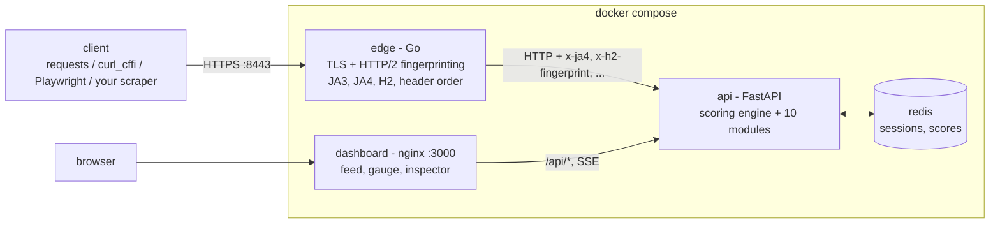

[](https://github.com/<your-user>/<your-repo>/actions/workflows/ci.yml)
[](https://codecov.io/gh/<your-user>/<your-repo>)
[](pyproject.toml)
[](pyproject.toml)
[](docker-compose.yml)
[](clients/playwright_client.py)
[](LICENSE)

> After you create the GitHub remote, replace `<your-user>/<your-repo>` in the CI and coverage badge URLs above
> (the other badges are static and work as-is). The coverage badge uses Codecov: it needs the repo on Codecov
> and, for pushes to a repo you own, a `CODECOV_TOKEN` repository secret (the upload step does not fail CI without it).
> Local coverage today: 96.47% (`fail_under = 90`).

# Akamai-style bot detection lab

A self-hosted, local-only playground that **simulates** Akamai-style bot detection (TLS/JA4, HTTP/2, header order,
`_abck`, sensor telemetry, proof of work, pixel, SBSD-style challenge, behavioral biometrics, IP reputation) so
you can test your own scrapers and automation against your own server and see exactly why each one is
scored the way it is.

> **DISCLAIMER.** This project SIMULATES Akamai-style detection for education and testing your own clients.
> It is not affiliated with, endorsed by, or derived from Akamai Technologies and contains no proprietary
> Akamai code. "Akamai" is a trademark of its owner. Use it only against the servers you run yourself.

## Architecture



More detail (request lifecycle, scoring, state keys): [docs/architecture.md](docs/architecture.md).

### Why an edge proxy?
TLS and HTTP/2 terminate before the ASGI app. FastAPI/uvicorn only ever sees a decoded request: it cannot see the
TLS ClientHello (cipher and extension order, GREASE), the HTTP/2 SETTINGS and WINDOW_UPDATE frames, the HPACK header
order, or the original header casing (Python servers normalise it). Real bot managers sit at the CDN edge for this reason,
so the lab has a small Go reverse proxy (`edge/`) that terminates TLS, computes the fingerprints and hands them to the api
as injected `x-*` headers (client-supplied copies are stripped). See [edge/README.md](edge/README.md).

## The 10 cases

| # | case | category | what it checks |
|---|---|---|---|
| 1 | [tls_fingerprint](docs/cases/tls_fingerprint.md) | passive | JA3/JA4 ClientHello family vs the User-Agent |
| 2 | [h2_fingerprint](docs/cases/h2_fingerprint.md) | passive | HTTP/2 SETTINGS, WINDOW_UPDATE, pseudo-header order |
| 3 | [header_order](docs/cases/header_order.md) | passive | header set, order and casing vs a Chrome baseline |
| 4 | [abck_cookie](docs/cases/abck_cookie.md) | cookie | `_abck` must be upgraded from `~-1~` to `~0~` and match server state |
| 5 | [sensor_data](docs/cases/sensor_data.md) | js | obfuscated JS telemetry POST |
| 6 | [proof_of_work](docs/cases/proof_of_work.md) | js | sha256 leading-zero puzzle (`sec_cpt` style) |
| 7 | [pixel_challenge](docs/cases/pixel_challenge.md) | js | per-session token via GIF then JSON beacon |
| 8 | [sbsd_challenge](docs/cases/sbsd_challenge.md) | js | per-issuance randomized JS computing a browser-derived value |
| 9 | [behavioral](docs/cases/behavioral.md) | behavioral | mouse path entropy, cadence, straightness |
| 10 | [ip_reputation](docs/cases/ip_reputation.md) | network | request rate and datacenter ranges |

## Results

Generated by `python -m clients.run_matrix` (✅ = allowed, ❌ = blocked). CI regenerates this table on every run
and fails if it drifts from `clients/expected_matrix.json`; per-signal reasons are in [RESULTS.md](RESULTS.md).

| case | naive | curl_cffi | playwright |
|---|---|---|---|
| tls_fingerprint | ❌ | ✅ | ✅ |
| h2_fingerprint | ❌ | ✅ | ✅ |
| header_order | ❌ | ✅ | ✅ |
| abck_cookie | ❌ | ❌ | ✅ |
| sensor_data | ❌ | ❌ | ✅ |
| proof_of_work | ❌ | ✅ | ✅ |
| pixel_challenge | ❌ | ✅ | ✅ |
| sbsd_challenge | ❌ | ❌ | ✅ |
| behavioral | ❌ | ❌ | ✅ |
| ip_reputation | ✅ | ✅ | ✅ |

- **naive**: plain `requests`, no scripts. **curl_cffi**: Chrome 131 impersonation, solves proof of work and pixel in
  pure Python, runs no JS. **playwright**: headless Chromium with a masked `navigator.webdriver` and a seeded Bezier
  mouse path.

### Observed fingerprints (real run)

| client | proto | JA4 | H2 fingerprint | header order (wire) |
|---|---|---|---|---|
| naive (`requests` 2.34.2) | http/1.1 | `t13d3112h1_e8f1e7e78f70_b26ce05bbdd6` | (none) | `Host,User-Agent,Accept-Encoding,Accept,Connection,X-Lab-Client,Cookie` |
| curl_cffi `chrome131` | h2 | `t13d1516h2_8daaf6152771_02713d6af862` | `1:65536;2:0;4:6291456;6:262144\|15663105\|0\|m,a,s,p` | `sec-ch-ua,sec-ch-ua-mobile,sec-ch-ua-platform,upgrade-insecure-requests,user-agent,accept,sec-fetch-site,...,accept-encoding,accept-language,priority,x-lab-client` |
| Playwright Chromium | h2 | `t13d1516h2_8daaf6152771_cca3cc876f32` | `1:65536;2:0;4:6291456;6:262144\|15663105\|0\|m,a,s,p` | `sec-ch-ua,...,user-agent,x-lab-client,accept-language,accept,sec-fetch-*,accept-encoding,priority` |

(`curl` itself gives `t13d3112h2_e8f1e7e78f70_b26ce05bbdd6`: same cipher/extension hashes as `requests`, but it offers `h2`.)

## Quick start

```bash
docker compose up --build                     # lab on https://localhost:8443, dashboard on http://localhost:3000
python3 -m venv .venv && .venv/bin/pip install -e '.[dev,clients]'
.venv/bin/python -m playwright install --with-deps chromium
.venv/bin/python -m clients.run_matrix --no-diff --output /tmp/lab-out
```

Full walkthrough, including pointing your own scraper at the lab and adding a case: [GUIDE.md](GUIDE.md).

## Repository layout

```
api/app/            FastAPI app: contract.py, engine.py, registry.py, session.py, store.py, main.py
api/app/modules/    one file per case (auto-discovered)
api/app/static/     readable source of the sensor script
api/tests/          pytest suite (one file per module plus engine/api/store/session)
edge/               Go TLS/HTTP/2 fingerprinting reverse proxy (+ Go tests)
dashboard/          static UI + nginx image (dashboard/dev/ holds a throwaway mock API)
clients/            naive, curl_cffi, Playwright clients and run_matrix.py + expected_matrix.json
docs/               cases/<slug>.md and architecture.md
.github/workflows/  CI
CONTRACT.md         internal build contract (topology, routes, state keys)
```

## Development

```bash
.venv/bin/ruff check .                                  # lint
.venv/bin/mypy                                          # types (api/app, clients)
.venv/bin/pytest --cov --cov-report=term-missing        # tests, fail_under = 90
docker run --rm -v $PWD/edge:/src -w /src golang:1.23 go test ./...   # edge tests
docker compose up -d --build --wait && .venv/bin/python -m clients.run_matrix   # end-to-end matrix
```

CI (`.github/workflows/ci.yml`): lint (ruff, mypy), test (pytest + coverage, Go tests), then the Docker Compose
client matrix with artifacts (RESULTS.md, results.json, compose logs). Run it manually with *Run workflow* and
`commit_results = true` (or set repository variable `COMMIT_RESULTS=true`) to let CI commit a refreshed `RESULTS.md` to main.

## License

[MIT](LICENSE). Copyright 2026 César Matias.
